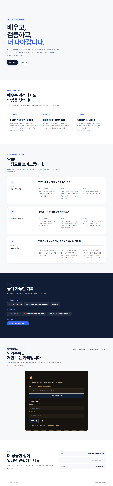

# 카드 1 — 무엇을 잠글지 먼저 가른다: 남길 것

> 원문: 공개 영역과 비공개 영역을 가른 화면, 그리고 로그인 없이 받은 응답 본문

이 카드는 전부 자동으로 캡처했습니다 (헤드리스 브라우저로 배포된 사이트에 직접 접속해서 확인).

## 1. 공개 영역과 비공개 영역을 가른 화면



로그인하지 않은 상태로 배포 URL 전체를 캡처한 화면입니다. Hero → About → Experience → Evidence(공개 섹션들)를 지나면, 어두운 색의 잠긴 박스(🔒)로 시각적으로 뚜렷하게 구분된 Private 섹션이 이어집니다.

## 2. 로그인 없이 받은 응답 본문

```
$ curl -s -i https://aleph-portfolio.vercel.app/api/private-items

HTTP/1.1 401 Unauthorized
Content-Type: application/json; charset=utf-8

{"error":"not_logged_in"}
```

401로 거절됐고(T08-C17), 응답 본문 어디에도 비공개 항목의 제목/내용이 없습니다(T08-C16).

## 3. 페이지 소스에 비공개 내용이 없다는 확인 (T08-C18)

로그인하지 않은 상태로 받은 실제 페이지 소스(`curl`로 받은 HTML, 총 1262줄)에서 등록된 계정들의 비공개 항목 제목을 검색했습니다.

```
$ curl -s https://aleph-portfolio.vercel.app/ -o page-source.html
$ grep -c "프로젝트 메모 (예시)\|지원 목록 (예시)\|스스로에게 남기는 회고" page-source.html
0
```

일치하는 부분이 0건입니다 — `index.html`은 정적 파일이라 서버가 페이지 자체에 비공개 데이터를 심을 방법이 없고, 비공개 항목은 로그인 후 JS가 `/api/private-items`를 호출해서만 화면에 그립니다 (`assets/private.js`의 `loadPrivateItems()`).
