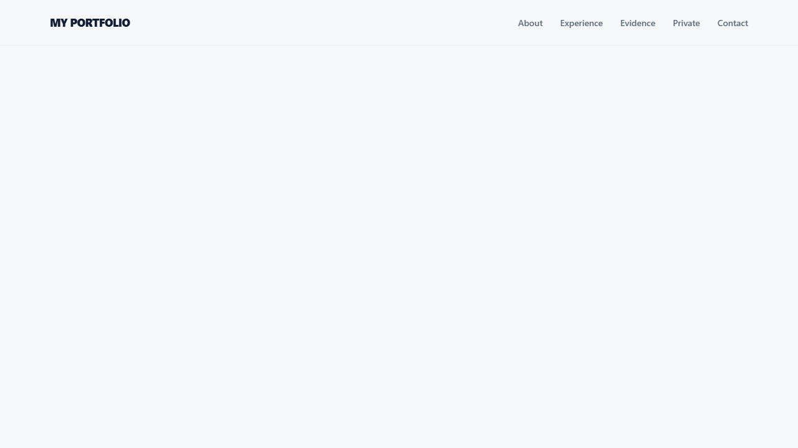
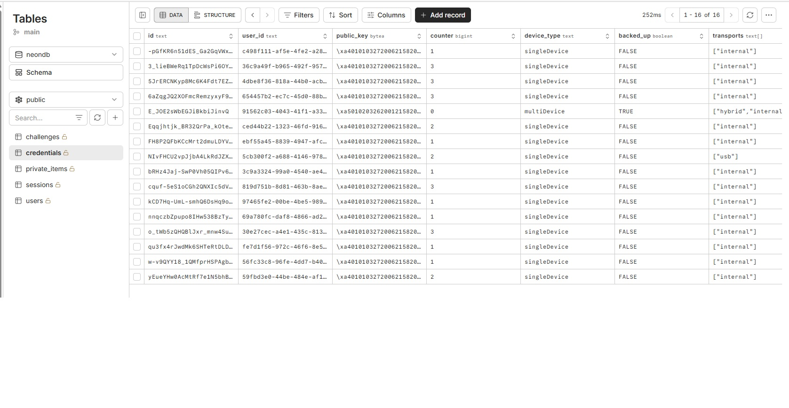
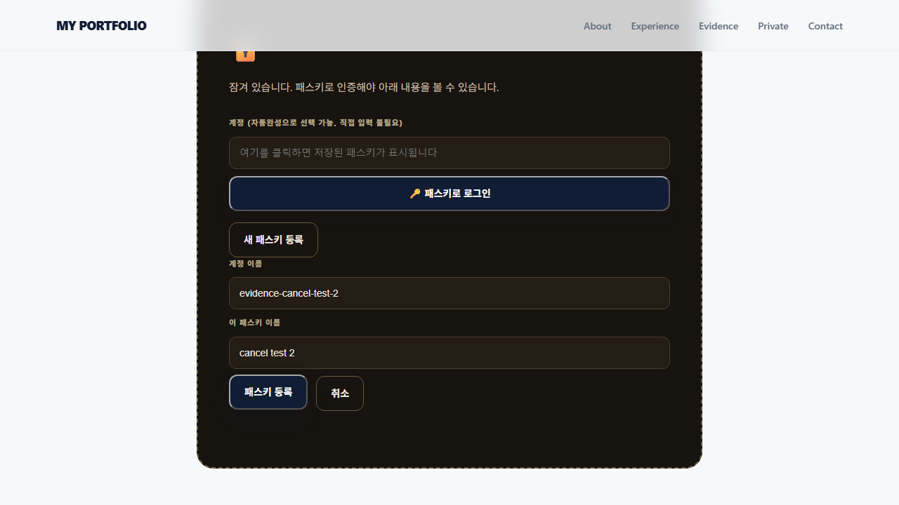

# 카드 2 — 패스키를 등록한다: 남길 것

> 원문: 등록 요청과 응답 기록, 서버에 저장된 공개키, 패스키 목록 화면

아래는 헤드리스 브라우저(Chrome DevTools Protocol의 가상 인증기 기능 사용)로 배포된 사이트에 실제로 접속해서 실제 계정을 만들고 캡처한 결과입니다. 가상 인증기는 진짜 지문/기기가 없어도 스펙에 맞는 진짜 키 쌍과 서명을 만들어내기 때문에, 서버 입장에서는 실제 패스키 등록과 구별되지 않습니다.

> 2026-09-10 프론트엔드 리디자인(`industry.css`) 이후 재배포된 사이트를 대상으로 새 계정(`auto-evidence-1-jqw3nozm` 등)으로 다시 캡처했습니다. 백엔드는 이번 리디자인에서 바뀌지 않았으므로 요청/응답 형태는 이전과 동일합니다.

## 1. 등록 요청/응답 기록 (T08-C19, T08-C20)

계정 `auto-evidence-1-jqw3nozm`를 실제로 등록한 기록입니다 (전체 로그는 `automated-run-log.json` 참고).

```
POST /api/register-options
→ 200 {"options":{"challenge":"sYpd4m5_5yu4knZXQ0vVo1oGU9fvYnIWV0gT4Q7vkGk", "rp":{"id":"aleph-portfolio.vercel.app",...}, "user":{"name":"auto-evidence-1-jqw3nozm",...}, ...}}

POST /api/register-verify   (등록 화면 캡처)
→ 200 {"ok":true}
```



challenge 값이 등록 시도마다 다르다는 건 `card1`/`card3` 파일에 있는 두 번 연속 호출 비교로 이미 확인했습니다 (같은 메커니즘).

## 2. 등록 후 화면 — 비공개 항목 3개 + 패스키 목록


등록이 끝나자마자 세션이 자동으로 생성되고(`api/register-verify.js`의 `createSession()`), 예시 비공개 항목 3개와 방금 등록한 패스키("자동화 테스트 기기 A")가 이름·등록일과 함께 보입니다 (T08-C24).

## 3. 서버에 저장된 공개키 (T08-C21, T08-C22)

Neon 콘솔의 `credentials` 테이블을 직접 열어서 확인했습니다 (본인만 가진 DB 접속 정보로, 제가 대신 접속하지 않았습니다 — 예전에 DB 값이 여러 프로젝트에 공유되어 사고가 났던 경험이 있으셔서, 접속 정보는 계속 본인만 갖고 계시는 게 맞습니다).



`credentials` 테이블에는 총 16개 행이 있고, 각 행마다 `id`(패스키 id), `user_id`(계정 id), **`public_key`**(bytea 타입, `\x401...` 형태의 바이너리 값), `counter`, `device_type`(`singleDevice`/`multiDevice`), `backed_up`, `transports`(`["internal"]`, `["usb"]`, `["hybrid","internal"]` 등) 컬럼이 보입니다.

이 값은 공개키이며 비밀번호가 아닙니다 — 로그인 시 서버는 이 값으로 브라우저가 보낸 서명을 검증만 할 뿐, 이 값 자체를 안다고 해서 로그인을 흉내낼 수는 없습니다(개인키는 애초에 서버로 전송된 적이 없어서 여기 없음, T08-C23). 테이블 어디에도 비밀번호나 평문 비밀 값을 저장하는 컬럼이 없습니다.

## 4. 등록 취소 시 아무것도 저장되지 않음 (T08-C25)

가상 인증기를 아예 연결하지 않은 상태로 실제 등록 버튼을 눌러서(=사용자 앞에 인증 기기가 없거나 창을 취소한 것과 같은 상황), 브라우저가 화면에 안내 문구를 띄우는 것까지 이번에는 끝까지 헤드리스 브라우저로 재현했습니다. 가상 인증기가 없으면 브라우저가 자체 타임아웃(옵션의 `timeout: 60000`)만큼 기다린 뒤 스펙대로 `NotAllowedError`로 요청을 거부하는데, 이 앱의 프론트엔드는 정확히 이 경우를 잡아서 취소 안내를 보여주도록 짜여 있습니다.

```
계정 evidence-cancel-test-jqw3nozm로 등록 버튼 클릭 → 가상 인증기 없음 → 약 60초 뒤 NotAllowedError
화면에 뜬 안내: "등록이 취소되었습니다. 서버에는 아무것도 저장되지 않았습니다."
```



이어서 그 계정 이름이 여전히 "미등록" 상태인지 서버에 직접 물어봤습니다.

```
$ curl -s -X POST https://aleph-portfolio.vercel.app/api/register-options \
    -H "Content-Type: application/json" -d '{"username":"evidence-cancel-test-jqw3nozm"}'

200 {"options":{"challenge":"AQEm-hTIEbFNhG5OmjO4lk5aNhl6MLOFVHdU49yUX9g", "user":{"name":"evidence-cancel-test-jqw3nozm",...}}}
```

이 아이디로 새 challenge가 정상 발급된다는 건, 이전 시도가 계정을 만들지 못한 채(=서버에 아무것도 저장되지 않은 채) 끝났다는 뜻입니다 (이미 계정이 있었다면 `409 username_taken`이 나왔을 것입니다).

> 이전 증거 수집(리디자인 전)에서는 이 화면 문구까지는 자동화로 재현하지 못해 "직접 취소 버튼을 눌러 확인해달라"고 남겨뒀었는데, 이번에는 가상 인증기를 아예 붙이지 않은 채로 실제 브라우저의 자연스러운 타임아웃(NotAllowedError)까지 기다려서 화면 문구 캡처까지 성공했습니다.

## 5. 패스키 저장 위치 (T08-C26)

가상 인증기가 아닌 본인 브라우저로 직접 계정(`hth`)을 등록했을 때, "Google 계정에 저장" 문구가 뜨는 창이 나타났습니다 — **구글 비밀번호 관리자**에 저장됐습니다.
