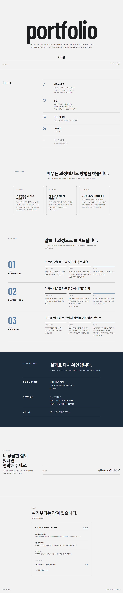

# 카드 3 — 패스키로 들어간다: 남길 것

> 원문: 성공한 로그인 요청과 실패한 요청, 이미 쓴 질문을 재사용한 요청과 거절 응답

이 카드 전체를 헤드리스 브라우저(가상 인증기 사용)로 실제 배포 서버에 접속해서 자동으로 캡처했습니다. (2026-09-10 프론트엔드 리디자인 이후 새 계정 `auto-evidence-1-jqw3nozm`으로 다시 캡처 — 백엔드는 그대로라 요청/응답 형태는 동일합니다.)

## 1. 로그인 challenge가 요청마다 다르다는 기록 (T08-C28)

```
$ curl -s -X POST https://aleph-portfolio.vercel.app/api/login-options
{"options":{"rpId":"aleph-portfolio.vercel.app","challenge":"b-Fp8SKYNhwLYzVeDxELaZrVKz7RtU97XaIb-fulzME", ...}}

$ curl -s -X POST https://aleph-portfolio.vercel.app/api/login-options
{"options":{"rpId":"aleph-portfolio.vercel.app","challenge":"e21ptW_vbUwkJt0iZHzAsyrMQoo6EDR0xg-K3OrH8FI", ...}}
```

## 2. 성공한 로그인 요청/응답 (T08-C29, T08-C30)

실제 계정을 하나 등록한 뒤 로그아웃 → 다시 로그인해서 캡처했습니다.

```
POST /api/login-options
→ 200 {"options":{"rpId":"aleph-portfolio.vercel.app","challenge":"uHBtHGQrm4aOOvliahe-cpLP6J8KB-hjRfW4FesMDFQ","timeout":60000,"userVerification":"preferred"}}

POST /api/login-verify
→ 200 {"ok":true}
```



## 3. 실패한 로그인 요청 + 이미 쓴 challenge 재사용 거절 (T08-C30, T08-C31)

등록된 적 없는 credential id(`nonexistent-credential-id-for-evidence`)로 같은 challenge(같은 `auth_flow` 쿠키 값)를 두 번 재사용한 기록입니다. 성공/실패가 나란히 보이도록, 그리고 재사용 자체가 별도 사유로 거절되는 걸 보이도록 구성했습니다.

```
--- 1) challenge 발급 ---
POST /api/login-options
Set-Cookie: auth_flow=(가림); ...
→ 200 {"options":{"challenge":"...", ...}}

--- 2) 그 쿠키로 첫 번째 login-verify (등록 안 된 credential id, 실패) ---
POST /api/login-verify   Cookie: auth_flow=(가림)
→ 401 {"error":"unknown_credential"}

--- 3) 완전히 같은 쿠키(같은 challenge)로 다시 요청 ---
POST /api/login-verify   Cookie: auth_flow=(가림)
→ 401 {"error":"login_expired_or_challenge_already_used"}
```

(원본 상태 코드/본문은 `automated-run-log.json`의 `"card3: first login-verify..."` / `"card3: SAME challenge reused a second time..."` 항목 그대로이며, 위에서는 `auth_flow` 쿠키 값만 가렸습니다.)

첫 요청에서 challenge가 소모(삭제)되고, 두 번째 요청은 challenge 자체를 찾지 못해 별도 사유로 거절됩니다 — `api/login-verify.js`의 `consumeChallenge()`(DELETE ... RETURNING 패턴)가 이 동작을 만듭니다.

## 4. 세션 식별 방식 (T08-C32)

이 앱은 **세션**을 씁니다(JWT 아님). 로그인 성공 시 서버가 `sessions` 테이블에 행을 만들고, 그 행의 id를 `sid`라는 httpOnly 쿠키로 브라우저에 내려줍니다. 매 요청마다 서버는 그 쿠키 값으로 `sessions` 테이블을 조회해서 로그인 여부를 판단합니다 (`lib/session.js`의 `createSession()` / `getSessionUser()`).

## 5. 로그아웃 후 같은 세션 값 재사용 거절 (T08-C33)

실제 계정(`auto-evidence-2-jqw3nozm`)으로 로그인해서 `sid` 값을 얻은 뒤, 로그아웃하고 나서 **같은 값**을 그대로 다시 보내봤습니다 (공격자가 세션 값을 미리 가로챈 뒤 로그아웃 이후에도 재사용을 시도하는 상황을 그대로 재현).

```
[로그아웃 전] GET /api/private-items  (Cookie: sid=(가림))
→ 200 {"items":[... 3개 항목 ...]}

POST /api/logout
→ 200 {"ok":true}

[로그아웃 후, 같은 sid 값 재사용] GET /api/private-items  (Cookie: sid=(가림))
→ 401 {"error":"not_logged_in"}
```

원본 상태 코드는 `automated-run-log.json`의 `"acc2: private-items before logout (sid reuse test)"` → `"acc2: logout"` → `"acc2: SAME sid reused after logout (expect 401 not_logged_in)"` 세 항목 그대로입니다 (상태 200 → 200 → 401, 항목 개수 3개 → 로그아웃 → 재사용 시 401).

로그아웃이 `sessions` 테이블에서 그 행을 즉시 삭제하기 때문에(`lib/session.js`의 `destroySession()`), 같은 쿠키 값을 그대로 재사용해도 더 이상 통하지 않습니다.

## 6. 기록에서 세션 값 가리기 (T08-C34)

위 5번 기록의 `sid` 값은 원문 대신 `(가림)`으로 적었습니다. 실제 세션 값은 그 자체로 로그인 상태를 가로챌 수 있는 민감한 값이라 이 문서에도, `automated-run-log.json`에도 원문 그대로는 남기지 않았습니다(로그에는 앞 6자 + `...(masked)` 형태로만 남깁니다. 예: `acc1: sid (masked)` 항목의 `"2aNBYn...(masked)"`).
