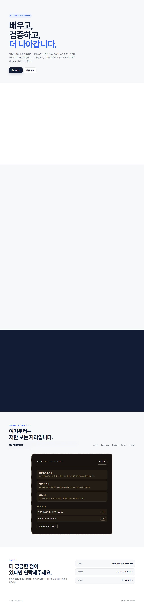
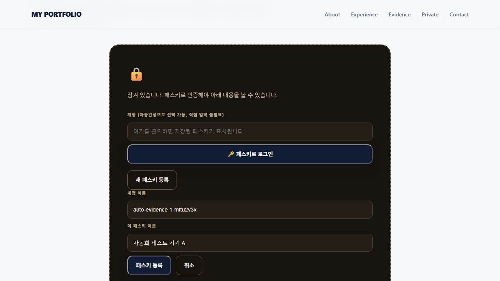
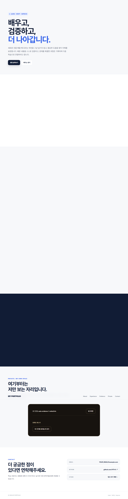

# 카드 4 — 기기를 잃어버렸을 때: 남길 것

> 원문: 패스키 두 개가 보이는 목록 화면, 하나를 지운 뒤의 로그인 성공과 실패 기록

전부 헤드리스 브라우저로 실제 계정에 실제 패스키 두 개(서로 다른 가상 인증기 = 서로 다른 기기처럼 동작)를 등록해서 캡처했습니다.

## 1. 패스키 두 개 등록 + 목록 화면 (T08-C42, T08-C43)

계정 하나에 첫 번째 패스키로 가입한 뒤, **다른 인증기(다른 기기에 해당)** 로 두 번째 패스키를 추가했습니다. (같은 인증기로 같은 계정에 두 번째 패스키를 만들면 "새로 추가"가 아니라 "기존 것을 덮어쓰기"로 처리되는 게 WebAuthn의 정상 동작이라, 원본 요구사항 문서의 막히는 지점 안내("다른 기기나 다른 브라우저에서 등록해 봅니다")와 정확히 일치합니다 — 실제로 저도 처음엔 같은 인증기로 시도했다가 이 현상을 직접 겪었습니다.)

```
등록 직후: passkeys = [ {"nickname":"자동화 테스트 기기 A", "created_at":"2026-09-09T08:25:29Z"} ]
두 번째 기기 추가 후: passkeys = [
  {"nickname":"자동화 테스트 기기 A", "created_at":"2026-09-09T08:25:29Z"},
  {"nickname":"두 번째 기기",         "created_at":"2026-09-09T08:25:31Z"}
]
```



이름과 등록일이 각각 다르게 보입니다.

## 2. 하나를 지운 뒤 남은 하나로 로그인 성공 (T08-C44)

```
DELETE /api/passkeys/<기기A의 credential id>
→ 200 {"ok":true}
```

로그아웃 후 다시 로그인:




로그인 화면(잠긴 상태)과, 남은 "두 번째 기기" 패스키로 다시 로그인해서 비공개 영역이 다시 열린 화면입니다.

## 3. 지운 패스키로는 로그인 안 됨 (T08-C45)

방금 삭제한 "기기 A"의 credential id로 직접 로그인을 시도했습니다 (서버 DB에는 이미 없는 id).

```
POST /api/login-verify   { "response": { "id": "<삭제된 기기A의 credential id>" } }
→ 401 {"error":"unknown_credential"}
```

## 4. 마지막 패스키를 지우려 하면 거절됨 (T08-C46)

남은 마지막 패스키("두 번째 기기")를 또 지우려고 시도했습니다.

```
DELETE /api/passkeys/<두 번째 기기의 credential id>
→ 400 {"error":"cannot_delete_last_passkey"}
```

이 앱은 마지막 남은 패스키는 서버가 삭제를 아예 거부하도록 만들었습니다 (`api/passkeys/[id].js` — 남은 개수가 1개면 400 반환). 비밀번호 같은 복구 수단이 없는 상태에서 마지막 패스키까지 지우면 그 계정엔 영영 들어갈 수 없기 때문에, 서버 단에서 막는 쪽으로 결정했습니다.

브라우저 화면에서도 같은 상황을 보고 싶으시면, 실제 배포 사이트에서 마지막 패스키를 삭제 버튼으로 지워보시면 "마지막 남은 패스키는 삭제할 수 없습니다..." 안내 문구가 뜨는 걸 바로 보실 수 있습니다.
