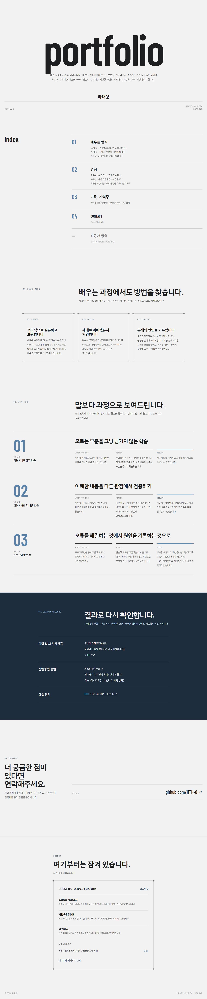

# 카드 5 — 정말 안 열리는지 확인하고, 어떻게 붙였는지 적는다: 남길 것

> 원문: 확인 네 가지의 요청과 응답, 인증 구현 설명서 여섯 항목

**인증 구현 설명서 여섯 항목, 짧은 확인 방법, AI 협업 부분은 `SUBMISSION.md`에 있습니다.**

카드5 고유의 "계정 두 개 교차 접근" 확인(T08-C36~C41)은 헤드리스 브라우저로 서로 다른 가상 인증기를 쓰는 계정 두 개(`auto-evidence-1-jqw3nozm`, `auto-evidence-2-jqw3nozm`)를 실제로 만들어서 전부 자동으로 확인했습니다. (2026-09-10 프론트엔드 리디자인 이후 재배포된 사이트를 대상으로 새 계정 쌍으로 다시 캡처 — 백엔드는 그대로라 동작은 동일합니다.)

## 1. 서로 다른 계정에 서로 다른 비공개 내용 (T08-C36)

계정1과 계정2 각각의 `/api/private-items` 응답에서 `id` 값이 서로 완전히 다릅니다 (둘 다 예시 항목 3개씩이지만, 실제 DB 행은 계정마다 독립적으로 생성된 것입니다).



## 2. 한쪽 세션으로 다른 쪽 자료 읽기 시도 → 거절 (T08-C37)

```
GET /api/private-items/<계정2 항목 id>   Cookie: sid=<계정1 세션>
→ 404 {"error":"not_found"}
```

## 3. 반대 방향도 동일하게 거절 (T08-C38)

```
GET /api/private-items/<계정1 항목 id>   Cookie: sid=<계정2 세션>
→ 404 {"error":"not_found"}
```

## 4. 거절 앞뒤로 상대방 자료 건수가 그대로임 (T08-C39)

```
거절 시도 전, 계정2 자신의 GET /api/private-items → items.length = 3
거절 시도 후, 계정2 자신의 GET /api/private-items → items.length = 3   (변화 없음)
```

## 5. 요청에 다른 계정을 적어 보내도 내 자료만 돌아옴 (T08-C40)

```
GET /api/private-items?userId=auto-evidence-2-jqw3nozm   Cookie: sid=<계정1 세션>
→ 200 {"items":[... 계정1 자신의 항목 3개, id 동일 ...]}
```

쿼리에 다른 값을 적어도 응답은 계정1 자신의 항목과 정확히 일치했습니다 (서버가 이 파라미터를 아예 읽지 않기 때문).

## 6. 이 거절을 만드는 소스 위치 (T08-C41)

- `api/private-items.js` 상단 주석과 쿼리: `WHERE user_id = ${user.id}` — `user`는 세션 쿠키로만 결정됩니다 (`lib/session.js`의 `getSessionUser()`), 쿼리/바디의 어떤 값도 신원 판단에 쓰이지 않습니다.
- `api/private-items/[id].js`의 `WHERE id = ${id} AND user_id = ${user.id}` — 항목 id가 존재하더라도 소유자가 다르면 0건으로 취급되어 404가 됩니다.

원본 자동화 스크립트의 전체 실행 로그는 `automated-run-log.json`에 있습니다.
